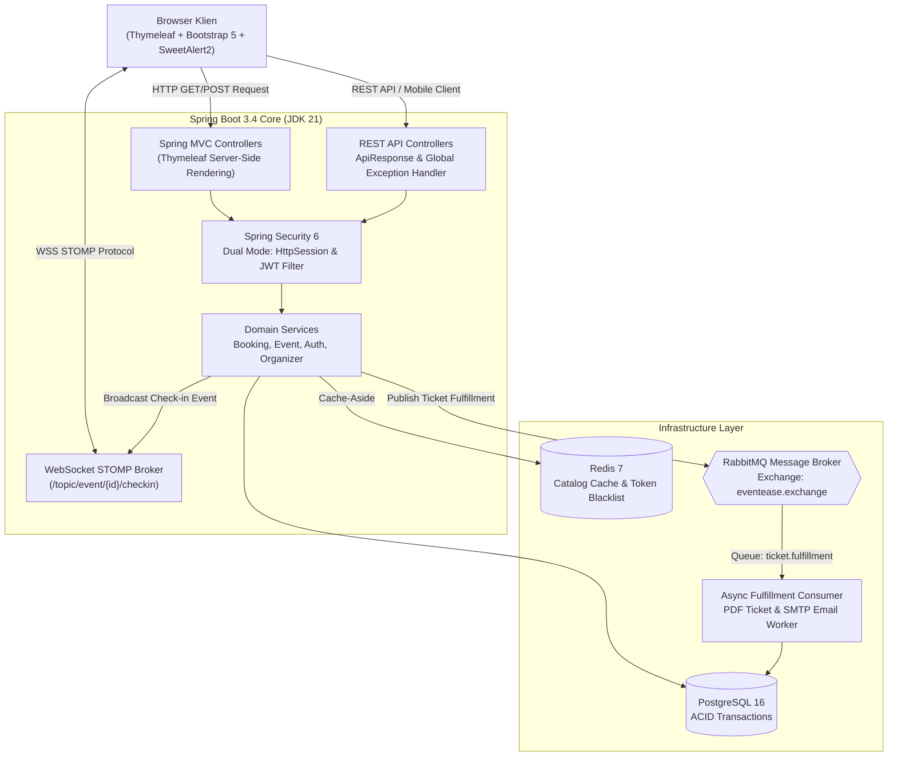

# Eventease - Modern Event Ticketing & Real-Time Check-In Platform

[](https://github.com/DujanahSr/eventease/actions/workflows/ci.yml)


Eventease adalah platform manajemen event dan *ticketing* berbasis web yang mempertahankan tampilan, tema, dan kenyamanan antarmuka asli **Thymeleaf & Bootstrap 5**, namun di-upgrade dengan fondasi teknologi enterprise modern: **Java 21**, **Spring Boot 3.4**, **PostgreSQL 16**, antrean pesan asinkron (**RabbitMQ**), caching performa tinggi (**Redis**), komunikasi dua arah real-time (**WebSocket STOMP**), REST API terstandarisasi (**JWT HMAC-512**), serta containerisasi mandiri (**Docker Compose**).

---

## 🏛️ Arsitektur Sistem



---

## 🚀 Fitur Unggulan & Nilai Rekayasa Perangkat Lunak

### 1. Tampilan Asli Thymeleaf 100% Terjaga
- Mempertahankan seluruh struktur template Thymeleaf, layout, warna, dan tema Bootstrap 5 yang telah dirancang sebelumnya.
- Dukungan autentikasi berbasis sesi (`HttpSession`) untuk navigasi web yang mulus, dilengkapi opsi stateless JWT untuk endpoint REST API.

### 2. Basis Data PostgreSQL 16 (Enterprise Ready)
- Menggunakan basis data relasional **PostgreSQL 16** dengan transaksi ACID, UUID generator, dan dialek otomatis Hibernate 6.
- Dilengkapi kapabilitas *multi-database fallback* yang tetap mendukung MySQL jika diperlukan.

### 3. Antrean Pemrosesan Asinkron (RabbitMQ)
- Pembuatan dokumen e-tiket PDF (OpenPDF + QR code ZXing) dan pengiriman email konfirmasi (SMTP) dialihkan dari siklus request HTTP ke **RabbitMQ background worker** (`ticket.fulfillment.queue`).
- Menghilangkan *latency* saat *checkout* Midtrans sehingga *throughput* server tetap tinggi pada kondisi lonjakan transaksi.
- **Graceful Fallback**: Jika broker RabbitMQ tidak aktif, sistem secara otomatis mengeksekusi proses secara sinkron tanpa menggagalkan transaksi pengguna.

### 4. Caching Katalog & Idempotensi (Redis)
- Endpoint katalog event publik (`/api/events`) diakselerasi dengan strategi **Cache-Aside** Redis berdurasi 10 menit.
- Mekanisme *cache eviction* otomatis membersihkan entri cache saat penyelenggara memperbarui atau menambah event.
- Webhook Midtrans menerapkan verifikasi *SHA-512 Signature Hash* dan penanganan status transaksi yang **idempoten** untuk mencegah duplikasi saldo atau kuota tiket.

### 5. Real-Time Check-In Dashboard (WebSocket STOMP) — *Showstopper Feature*
- Penyelenggara acara (*Organizer*) memiliki akses ke dashboard pantauan langsung kedatangan peserta tanpa perlu melakukan refresh halaman.
- Saat gatekeeper/panitia memindai kode QR tiket di lokasi, backend memvalidasi tiket secara transaksional dan mempublikasikan payload ke topik WebSocket `/topic/event/{id}/checkin`.
- Layar dashboard secara instan memperbarui *live counter* kehadiran dan menampilkan *feed* peserta yang baru masuk secara real-time.

---

## 🛠️ Tech Stack

| Komponen | Teknologi | Keterangan |
|---|---|---|
| **Backend Runtime** | Java 21 (Eclipse Temurin) | Modern LTS Java |
| **Framework** | Spring Boot 3.4.0 | Core backend framework |
| **Security** | Spring Security 6 & JJWT 0.12.6 | Dual Mode (HttpSession & JWT) |
| **Frontend Web** | Thymeleaf 3.1 + Bootstrap 5 | Server-Side Rendered (Tampilan Asli) |
| **Database** | PostgreSQL 16 Alpine + Spring Data JPA | Transaksional ACID & Hibernate ORM (Auto Dialect) |
| **Caching** | Redis 7 Alpine | Spring Cache & Token Blacklist |
| **Message Broker** | RabbitMQ 3 Management Alpine | Asynchronous ticket fulfillment |
| **Real-Time** | Spring WebSocket + STOMP | Real-time attendee check-in broadcasting |
| **Payment Gateway** | Midtrans Snap API | Pembayaran QRIS, GoPay, VA |
| **Media & PDF** | Cloudinary API + OpenPDF | Cloud storage & e-ticket generation |
| **DevOps** | Docker & Docker Compose | Multi-container production deployment |
| **CI/CD** | GitHub Actions | Automated build and test pipeline |

---

## ⚡ Panduan Menjalankan Proyek

### Menjalankan untuk Pengembangan Lokal (Local Development)

1. Pastikan **PostgreSQL** berjalan pada port `5432` dan buat database `eventease_db` (misalnya via DBeaver).
2. *(Opsional)* Jalankan Redis (port 6379) dan RabbitMQ (port 5672). Jika tidak ada, sistem akan berjalan normal dengan *in-memory fallback*.
3. Jalankan aplikasi via terminal:
   ```powershell
   # Windows
   .\mvnw.cmd spring-boot:run

   # Linux/macOS
   ./mvnw spring-boot:run
   ```
4. **Buka browser Anda**:
   Akses **`http://localhost:8081`** untuk menikmati tampilan asli Eventease!

---

### Menjalankan via Docker Compose (Multi-Container)

```powershell
# 1. Salin file environment
cp .env.example .env

# 2. Jalankan seluruh stack (PostgreSQL, Redis, RabbitMQ, Spring Boot)
docker compose up -d --build
```
Akses aplikasi di `http://localhost:8081`.

---

## 🧪 Continuous Integration (CI)

Proyek ini diproteksi oleh **GitHub Actions CI** (`.github/workflows/ci.yml`) yang berjalan otomatis pada setiap aksi *push* dan *pull request* ke branch `main`:
- Menjalankan pipeline pada runner `ubuntu-latest` dengan Eclipse Temurin JDK 21.
- Menguji kompilasi Maven dan memastikan tidak ada *breaking changes*.

---

## 📄 Lisensi
Didistribusikan di bawah lisensi terbuka [MIT License](LICENSE).
